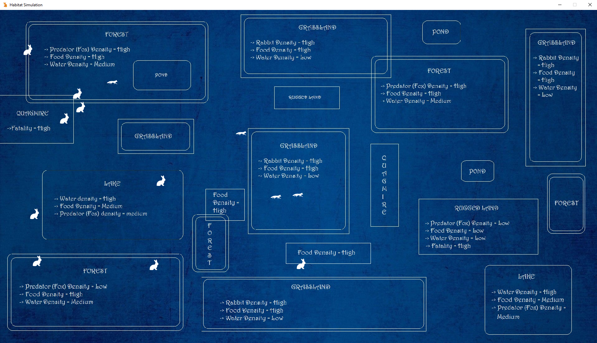

Abstract: 
Darwin’s theory of natural selection states that individuals with genetic traits better suited to the environment survive. This could mathematically be stated as with time, the dispersion/scattering of genetic characteristics within a domain decreases as more and more of the living population tends to progress towards the fitter traits, while individuals with weaker traits are wiped out. We simulate a three tier ecosystem (autotrophs, herbivorous  primary consumers, and carnivorous secondary consumers), and study the population curve and the corresponding change in the entropy, mean-absolute deviation, median-absolute deviation, and standard deviation of the genetic characteristics. This helps to validate and visualize Darwin’s theory using simple artificial intelligence. The initial population is assorted with traits randomly and offsprings get a mixture of traits of the parents, and successive neonates inherit traits from parents. Several such simulations have been performed and the results have been presented. 
</i></b> 

Structure of ecosystem: 
The ecosystem consists of producers (autotrophic) (plants), primary consumers (rabbits), and secondary consumers (foxes) 
The sources of food for the rabbits include grasslands and forests. The sources of water for the foxes and rabbits include lakes and ponds. 
The plants (in forest and grasslands) regenerate themselves slowly (sunlight) and the water in lakes and ponds regenerate through rainfall. 

Genetics: 
Each Animal has Genetics G defined by the 7-tuple (M, S, Hs, Hr, Tr, P, V) where: 
  <ul>
  <li>M = mating requirement</li>
  <li>S = size of steps the animal takes</li>
  <li>Hs = hunting skill (only for fox)</li>
  <li>Hr = resistance to hunger</li>
  <li>Tr = resistance to thirst</li>
  <li>P = fear of predator (only for rabbit)</li>
  <li>V = vision radius</li></ul>

Definition 1: Animal 
We define an animal as a six-tuple (A, H, T, M, p, G) where: 
       <ul>
       <li>A = age</li>
       <li>H = hunger</li>
       <li>T = thirst</li>
       <li>M = urge to mate</li>
       <li>p = position in the food chain</li>
       <li>G = genetics (traits)</li></ul> 
    Here, only p and G remains constant for a particular animal

 
   
 Definition 2: Rabbit 
 We define a rabbit as an animal with p = 2

 

 Defintion 3: Fox 
 We define a fox as an animal with p = 1

 

 Defintion 4: Landform 
 We define a landfrom as the triplet (L, F, W) where: 
        <ul>
        <li>L = set of locations</li>
        <li>F = current food availability</li>
        <li>W = current water availabilty</li></ul>

 

  Landforms are of types: 
        <ul>
        <li>Grassland</li> 
        <li>Forest</li>
        <li>Lake</li>
        <li>Pond</li>
        <li>Quagmire</li>
        <li>Rugged Land</li></ul>
        

<b>Mating mechanism:</b> 
Say, animal A1 and animal A2 are taken under consideration 
Mating will be successful if and only if A1.M and A2.M are both greater than some value 
Say, the offspring is animal O. 

∀ gi  ∊  O.G,  O.G.gi  =  (A1.G.gi)  |  (A2.G.gi) 

Here the c = a | b means c is assigned the value a with a 50% chance and value b with a 50% chance

Procedure:
We can implement more variation (or more randomly generated traits) in the initial population. Tweaking the randomness even a minute amount can produce drastically 
  different results (as seen by the graphs plotted by <i>stats.py</i>)
We can study the variation of the natural resources as population of animals changes with time as shown by  <i>plot_resource_changes(parameters)</i> method in <i>stats.py</i>
We have to use different types of randomly generated traits and study the numerous possibilities and try to decipher the relationship between the degree of dispersion of genetic traits and population.

Methods are also provided to visualize the evolution process through the <i>run_with_visualisation(num_times: int)</i> method. The visualization should like this:

 
 
 
 
 
 
 
 
 
 
 
